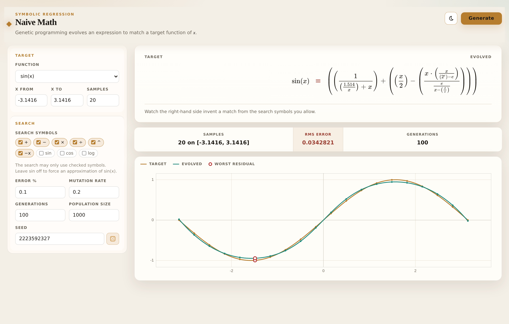
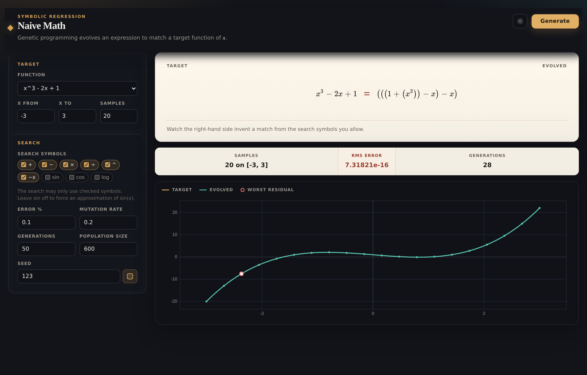

# Naive Math

A browser demo of **symbolic regression**. Genetic programming evolves an
expression to match a target function of _x_.

The interesting split is the two languages. The *target* may be written
with `sin`, `cos`, and `log`. The *search* defaults to algebra only
(`+ − × ÷ ^`). Fitting `sin(x)` then has to invent an approximation —
it cannot spell `sin(x)` back on generation 1.


<p align="center"><sub>Dark theme · seed <code>2223592327</code> · RMS 0.034 over 20 samples on [−π, π]</sub></p>



Named targets can also be rediscovered exactly. Seed `123` finds
`x³ − 2x + 1` as `((1 + x³) − x) − x` in 28 generations (RMS ~ 10⁻¹⁶):



## Run

```bash
./start.sh
```

Then open [http://localhost:9000](http://localhost:9000). Static files,
no build, no backend. Evolution runs in a Web Worker so the page stays
responsive.

Press **Generate**. The evolved side updates live; the plot is target
(gold) vs current best (teal), with the worst residual marked.

## Replay a run

Every generate writes the knobs into the URL hash. Reload, or share the
link, to replay the same search. A random target also stores `tseed`, so
the question is pinned as well as the answer.

This is the `sin(x)` run from the screenshot:

```
#seed=2223592327&pop=1000&gen=100&mutation=0.2&error=0.1&target=sin(x)&ops=add,sub,mul,div,neg,pow&xmin=-3.1416&xmax=3.1416&samples=20
```

Turn on **Keep target** to hold a random function and roll only the
search seed.

## Knobs that surprise people

| Control | What it actually is |
| --- | --- |
| **Error %** | Stopping tolerance: RMS as a percent of the target's scale (with a tiny absolute floor near zero). Not a display unit. |
| **Samples** | Fitness grid size. The plot draws a denser curve; scoring does not. |
| **Search symbols** | The only operators the population may use. Leave `sin` off to force an approximation of `sin(x)`. |
| **Seed** | The *search*. A random target has its own `tseed`. The dice also clears a pinned target seed. |

## Tests

```bash
node gene.test.js && node gene-worker.test.js
```

No extra dependencies. `gene.js` is the engine (tournament selection,
elitism, subtree crossover, protected ops, parsimony, depth caps,
seedable PRNG). The worker and the page are thin wrappers around it.
